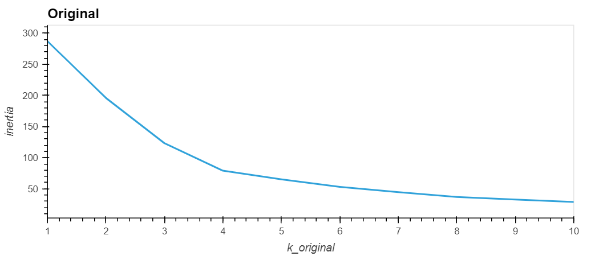
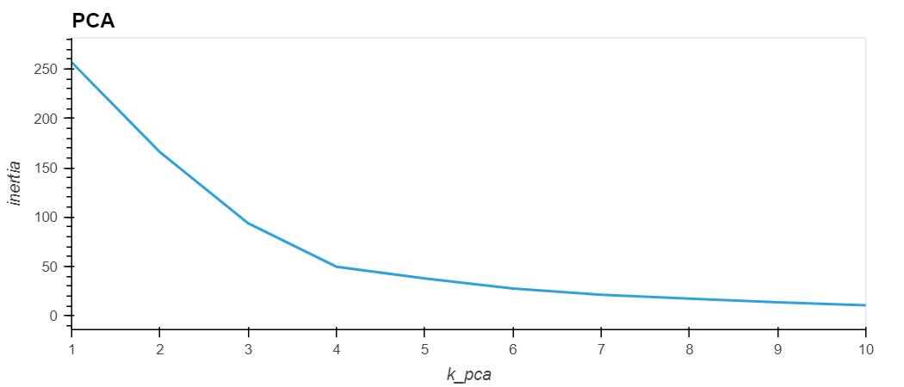
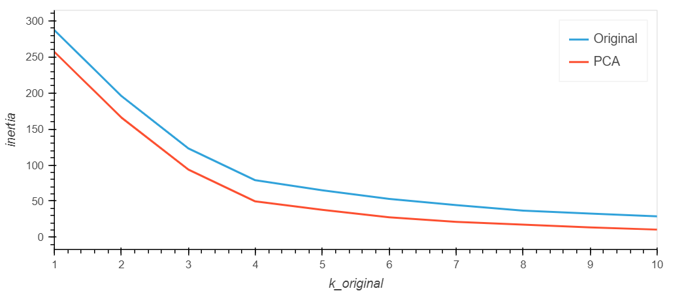
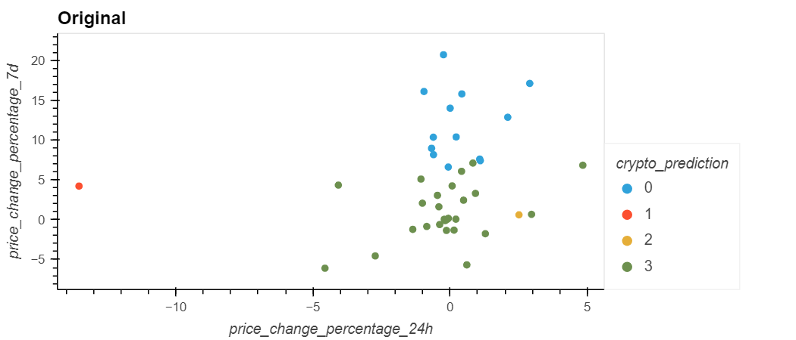
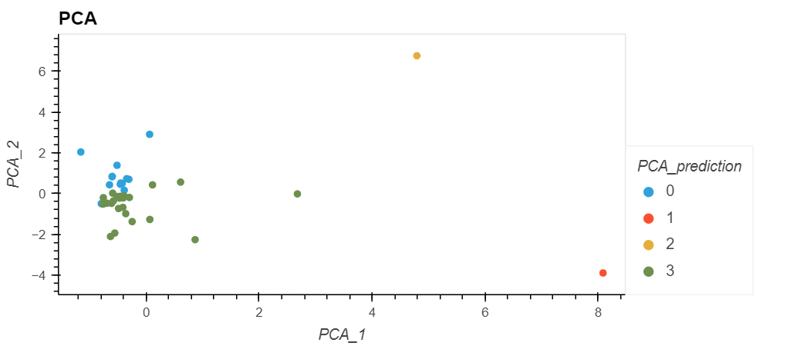

# Cryptocurrency Clustering: An Unsupervised Learning Approach

## Introduction

In this analysis, the emphasis was on leveraging Python and unsupervised learning techniques to predict how cryptocurrencies respond to fluctuations in price over a span of 24 hours or 7 days. The project encompassed creating a novel repository termed as 'CryptoClustering', importing the 'crypto_market_data.csv' into a DataFrame, and utilizing the StandardScaler() module from scikit-learn to normalize the data from the CSV file. Following data preparation, the optimal value for 'k' was determined employing the elbow method. Ultimately, the K-means algorithm was used to cluster the cryptocurrencies using the initial scaled data, and the clusters were fine-tuned using Principal Component Analysis (PCA).

### - Elbow Curve for original Data

### - Elbow Curve for Principal Component Analysis Data

### - Elbow Curve Comparison

### - Cluster plot of cryptocurrency based on the original data

### - Cluster plot of cryptocurrency based on the Principal Component Analysis Data

## Conclution

The comparison of the above images reveals that the Principal Component Analysis Data facilitates a lower inertia, resulting in more distinguished clusters than those achieved using the original data. This observation suggests that the PCA model is characterized by less noise and superior separability when compared to the original model.

## Tools

- Jupyter Notebook
- Python
- pandas
- NumPy
- scikit-learn
- hvPlot

## Main File

- [Jupyter Notebook](/Crypto_Clustering.ipynb)
